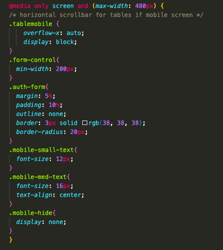

<p align="center">
    
</p>

# 'Album Review App' : SEI Project 2             

## Description:       

This is a full-stack web app - _Album Review App_: a site where users can add and then review music albums - built as part of a paired project with [Milos Jocic](https://github.com/milosjocic1) over the course of a week, for the second project in GA London's Software Engineering Immersive course. The app uses an Express framework, Node.js platform and an Atlas-hosted MongoDB NoSQL database. The deployed project was presented to my GA Instructional Team and fellow SEI cohort on 26/08/22.        

I was 'Team Leader' for this project, taking responsibility for Git version control and deployment of the completed app. I worked on broader functionality across the site both in Frontend and Backend: setting up `server.js` config, creating Models, writing routes and APIs, implementing Views, forms and user input. I also took ownership of UI styling and mobile responsive formatting.        

        

## Links:        

[Deployment link](https://albumreviewapp.cyclic.app/review/index)      

## Getting started & Install:       

Please feel free to sign in as user: `guest@guest.com` // pw: `London2012`, or you can create your own account with 'Sign Up'.      

Please note that at present, there is an issue with image upload where Heroku's ephemeral file storage deletes any newly uploaded images after less than 24 hours. As such, many of the image links are currently broken where uploaded files have been removed, and any images newly uploaded will not persist past a 24 hour period before breaking.           

To contribute, please fork from [GitHub](https://github.com/hphilpotts/Album-Review-App-Project-2-General-Assembly-SEI-66) and then run `npm i` to install the required dependencies, alternatively see `package.json`, submitting a pull request for any completed contributions.      

## Technologies used:       

- HTML5, CSS3, ES6 JavaScript, EJS, Mongoose        
- Express, Node.js, Atlas-hosted MongoDB        
- Express-EJS-Layouts, Multer image upload, Heroku app hosting       
- Visual Studio Code, MongoDB Compass       

## Brief & Project aims:        

The brief for this project was to build a web app as a pair 'from scratch', using an Express framework. Technical requirements included:        
- Use Express, Mongoose, Node.js and MongoDB to build the app, host the completed app on Heroku.              
- Employ MVC architecture in building the app.      
- Include a User resource, with signup/in and authentication/authorisation.            
- Include two other resources with full CRUD functionality.          

Stretch goals included:     
- Make the app mobile responsive.       
- Make use of a CSS library such as Bootstrap.      
- Add image upload functionality.       

The aim of the project was to consolidate our learning from weeks 4 & 5 of the course: in particular the concepts of 'Frontend' and 'Backend', OOJS, and non-relational database associations, as well as the use of Express, EJS, Mongoose, and MongoDB. In addition to consolidating knowledge, this project provided a first experience of working with another developer, with all the additional considerations and necessities, for example management of Git/GitHub process, communication and planning, and collaborative problem-solving.        

## Production Process:      

### 08/09/22 | Day 0 | Brief issued, planning:      

Our initial project idea was a 'DIY' app where users could upload and share instructions and projects. I set up our Trello board, and using Figma's 'multiplayer' collaboration we jointly wireframed our project and wrote out our ERD [here](https://www.figma.com/file/G63VmlG1NHGvTbEyLctO6H/DIY-Blog-Wireframes?node-id=0%3A1).        

We decided to share ownership for basic app setup, before each taking ownership for a non-user model and its associated controllers, views and routes. Milos would later implement authentication/authorisation and image uploads, and I would move on to UI/UX and mobile responsiveness.          

     

     

     

This idea was changed to an Album Review App on day 2: this was an idea that we were both more excited about and therefore both bought into more.       
    
### 09/09/22 | Day 1 | Production:      

My primary focus today was on getting the app structure setup: server config, MVC architecture, key dependencies; and getting our respective repositories set up correctly.      

After setting up the app, adding config to `server.js`, and creating our Models based on our ERD, I then moved on to my first CRUD APIs and views.      

We decided early on that clearly and cleanly splitting workstreams was helpful, as it minimised the time we spent editing the same files at the same time (thus reducing conflicts) and reduced the likelihood of duplication of work.       

Despite this, we still ran into merge issues early on. In hindsight, the issues seen could have been minimised by running `git fetch` in the forked repo and resolving merge issues there, rather than pushing two strongly differing versions at the same time and resolving in the main repo. Eventually through screen sharing we were able to fix merge issues and get going again.      

### 12/09/22 | Day 2 | Production:      

After the weekend we made the decision to switch project direction and go for an Album Review App rather than a DIY one - I'm really glad we did this, and it was early enough in the project that judicious use of 'find + replace' was enough to quickly complete the needed changes.        

I quickly found when trying to implement 'add another input field to form' functionality that 'vanilla' JS DOM manipulation wasn't working as expected when I wrote:        

```
<%  const newInput = document.createElement("input");
    newInput.setAttribute('type', 'text');
    newInput.setAttribute('name', 'trackList');
    newInput.setAttribute('class', 'form-control');
    const parentElement = document.getElementById('track-parent');
    function newElement(){
        parentElement.appendChild(newInput);
    }
    document.getElementById("add-field").addEventListener(click, newElement);
%>
```

I was getting `document is not defined` - a quick bit of googling revealed that "_You can't use document inside your ejs tags because that code is executed on the server_.". A change of approach was required!      

First, using similar code in a `main.js` file allowed for just one input box to be added. I then tried using jQuery instead like so and it worked:      

       

Outside of the above 'puzzle', this was a productive day. Importantly I had learned important lessons about (and gained confidence in) using EJS vs. JS as above!       

### 13/09/22 | Day 3 | Production:      

After some difficulty getting data from the database to populate, it turned out (surprise, surprise) that I needed...`.populate()` within my APIs:          

        

Ensuring Album documents and User documents are updated correctly when reviews are added was a challenge but also a key step. Milos implemented User association through using a hidden input field for `currentUser._id` within 'Create Review' form, I implemented associating by reference with Album as follows:        

        
_- Update Albums with reviews in reviews controller._       

A further challenge faced was displaying linked reviews within Album Detail GET views, as well as then also displaying the Users who created the displayed reviews. Eventually - after a lot of documentation and _stackoverflow.com_ - I sought advice from instructors who guided me to the below solution:       

```
    Album.findById(req.query.id).populate({ 
        path: 'review',
        populate: {
          path: 'createdBy',
          model: 'User'
        } 
```

_Not something I think I could have worked out solo - an important reminder that sometimes, asking for help is the best thing to do!_       

The last key challenge of the day was where in the Review model, `createdBy` was an array:        

       

Which - after some trial and error - required the following code (including use of `index 0`) to correctly display in `album/detail.ejs`:   

`<div> Reviewed by: <a href="/review/detail?id=<%= review._id %>"><%= review.createdBy[0].username %></a>, rating: <%= review.rating %></div>`      

### 14/09/22 | Day 4 | Production:      

I predominantly spent this day on UX and styling as the presentation deadline approached. I chose a 'retro', _Rolling Stone_ magazine-inspired style for the app.           

One snippet I was pleased with was a bit of EJS that dynamically punctuated the 'genre' array in album detail:      

       

Also, displaying avg. review rating:        

       

### 15/09/22 | Day 5 | Final day of production:     

This was a challenging day: getting Bootstrap to display album cards how we wanted (as per Wireframe) proved difficult to the point that we eventually reverted to vanilla CSS. A lesson learned in that Bootstrap is great for many things but not all things!     

On the other hand, Bootstrap proved particularly useful for things like mobile-responsive headers:     

      

I did, however, have to remove a lot of CSS positioning to allow Bootstrap to 'do its thing'. In some cases, this was not enough to give proper responsiveness. As such, I used `display: hide` as part of a media query to remove less important information in order to view on a smaller screen:      

       

At this point, things started to go drastically wrong for us when uploaded images started to disappear. As we did not at the time know that Heroku's file storage was behind this, we started reverting back to previous commits in order to purge the error that (unsurprisingly) we could never quite pinpoint.       

I then made the critical mistake of editing in the `master` branch in error, meaning that merging with Milos' parallel edits in `dev` caused a vast amount of conflicts. With the deadline close approaching (and a 'broken' project), we rushed the merge, meaning that my eariler work on mobile responsiveness was lost. This was a major lesson learned and a key point in my coding journey so far - _never again_!      

### 16/09/22 | Day 6 | Presentation:        

We agreed to no further edits on presentation day, and were able to present a working app (with all images present).        

The image loss issue appeared again, some research turned up the following from _stackoverflow.com_:        

```
I'm not sure why your uploads aren't being saved; you should be able to save them temporarily.
But this won't work long-term. Heroku's filesystem is ephemeral: any changes you make will be lost the next time your dyno restarts, which happens frequently (at least once per day).
Heroku recommends storing uploads on something like Amazon S3. Here's a guide for doing it specifically with Node.js.
Once you've stored your files on S3 you should be able to retrieve them using an appropriate library or possibly over HTTP, depending on how you've configured your bucket.
```     

...mystery solved! Which was a satisfying end to a project that - whilst challenging at times - proved to be an important milestone in my learning journey, as well as a really enjoyable week of collaborative coding for the first time!      

## Key takeaways and learnings:     

This was a really exciting project for me, as it was the first time I had properly collaborated with another developer on a piece of work. We had been given relatively little in the way of guidance or instructions when it came to working as a pair; as a result, we had to very much learn how best to code together 'on the fly' which was both challenging and rewarding. I am really grateful for the fact that Milos and I had a great working dynamic: our skills and approaches complemented each other and we had fun working on this project together - for me this was a great start to collaborative coding!       

Much of the project was completed using very close collaboration, particularly using screen sharing. The benefits of working together became apparent very quickly: two pairs of eyes catch bugs more quickly, and one person may remember a small but crucial tidbit of information from a past lecture where the other does not. Equally, the challenges of working as a pair rather than solo also became apparent very quickly: Git & GitHub become significantly more complicated to use compared to lone working, code conflicts are many and frequently encountered, and time management becomes more important.       

Ultimately, this project was really enjoyable, and the feeling of collaboratively producing something you are proud of made me feel excited for my future working in software development. I learned a lot both technically and in terms of how best to work as a team, and came away from the project more confident in my skills and knowledge.

Some key learnings from this project were as follows:       

- Git discipline is key: as soon as this slips, things start to go wrong quickly. A methodical, structured approach combined with clear and consistent communication was crucial for smooth merges and seamless pull requests. Further to this, merge issues are not a disaster: they are part and parcel of collaborative coding; don't panic and don't rush resolving conflicts!        
- Debugging as a pair is a great way of resolving issues quickly when you have run out of ideas working solo. Fresh eyes and a new perspective are often the key to unlocking a problem straight away!      
- It's fine to change your project idea (if you do it early enough).     
- Even if it is initially unfamiliar, EJS is 'still just JavaScript' (albeit with some differences and limitations): at first I struggled to translate my understanding of JS into using EJS, but once I got over the few differences it just 'clicked'. This was a great feeling! Also, Express-EJS-layouts template-based views are a quick, powerful and efficient way of building and managing a web app - I really enjoyed using these.           
- Finding the 'right' communication is key: for us, this was about striking a balance between consistent and frequent communication in order to collaborate effectively, without needlessly breaking each others' concentration when working. Slack messages were great for non-urgent comms, whereas zoom was great for more immediate communication. Our [Trello board](https://trello.com/b/0mU24NKC/project-2-express-album) below was key to keeping track of who was doing what:         

      

- Lastly, bugs and errors are part and parcel of coding and shouldn't be a source of panic. Crucially, chasing bugs should never lead to the loss of work and code. Calm decisions are good decisions, rushed and impulsive decisions are typically **not** good decisions.       

## Successes and Challenges:      

Main 'wins' and successes from this project included:       
- Gaining confidence working with the Express framework, implementing CRUD operations, writing in EJS. Also, building a clearer understanding around the concepts of frontend/client-side and backend/server-side.          
- Getting experience working as a team rather than solo, as well as building confidence using Git/GitHub version control as a pair, and resolving merge conflicts. Further to this, I really enjoyed the experience of being a Team Lead for this project: particularly setting direction, providing support, having responsibility for the main GitHub repository, and hosting the finished app on Heroku.      
- Building confidence working with CSS: at times I struggled with CSS in Unit/Project 1, however during this project I found the concepts that previously seemed challenging - for example, positioning and flexbox - started to make more and more sense the longer I worked on them and the more issues I resolved.       
- Seeing an API work correctly after a lot of work was a great feeling and very quickly got me interested in working on backend code.              

Challenges faced during the project included:       
- Managing Git/GitHub repositories, forks, branches and merges between two contributors for the first time. At points this was challenging, however this also made for a great learning experience (despite some dark moments where time and/or work was lost).      
- Facing merge conflicts: at first we assumed this was because we were doing something wrong - and indeed that merge conflicts were something to be worried about rather than expected - and this led to moments of panic (which is _not_ the right way to approach coding).        
- Backend error terminal messages were daunting at first, being longer and less transparent than typical frontend messages, however in time we learned that the key bits are normally at the start or end of the message.       
- Finding a balance between using Bootstrap to quickly add pre-made styling and elements, and using CSS to build and style our app in a more precise way that better suited our needs. Bootstrap is great for specific, quick, polished additions to the app, however I found that if Bootstrap did not provide exactly what we needed, it was quicker to 'custom make' elements of our site rather than lose significant amounts of time to trying to amend and wrangle Bootstrap into doing what we wanted! Further to this, conflicts can arise between Bootstrap CSS and vanilla CSS if care is not taken.        
- Lastly, integrating image uploads (and getting this to work correctly) proved a challenge - doubly so when the app is hosted on Heroku rather than locally.       

## Bugs & Issues:       

       

- Uploaded images are lost (and therefore `` links break) after <24 hours: this is due to Heroku's ephemeral filesystem.       
    _Workaround completed 24/11/22, see post-production below._        
- Upload functionality on 'Edit Albums' view is not working.        
- User sessions do not save consistently, as such login is occasionally required again during a single session.         
- User views not implemented, header link instead directs to the main page.     
- Passport/session issue found when app was rehosted on Cyclic - the user is logged out in error when navigating the app             

## Future improvements:     

- All image upload functionality fixed and stabilised.      
- Full mobile-responsive formatting.        
- Delete album functionality hidden, edit functionality protected.      
- Spotify API for album info, artwork.      
- Change ‘add review’ functionality where the user can click an ‘add review’ button on any album.             
- Search and filter by users, artists, genres.      
- Refactor code and remove unneeded comments, console.logs() etc.       

---

## 23/11/22 | Post-production:     

With Heroku moving to paid-only on 28/11/22, this seems as good a time as any to re-host the app elsewhere and fix the image upload issue at the same time.         

I have hosted the app on _Cyclic_ which was super easy through GitHub integration - much more user friendly at this stage as compared with Heroku.      

After a failed attempt at implementing AWS S3 Bucket storage on 20/11/22 (which resulted in my accidentally exposing a key/secret key...lesson learned but thankfully no harm done!), I am going to try again. My experience of AWS thus far is that there is a very steep learning curve!      

Branched into `fix-image-upload`. Following [this guide](https://plainenglish.io/blog/file-upload-to-amazon-s3-using-node-js-42757c6a39e9).     

Bucket created, `.env` updated with Bucket name, location and ARN. Policy set in IAM:       

        

Policy created - after some issue adding ARN (don't past directly into ARN value, just paste into bucket name/click any for object name).       

Creating user, see key tip below:       

      

Above policy attached. Key and Secret Key added to `.env` file.     

Installed `aws-sdk dotenv`. At this stage, my app structure deviates significantly from that in the article. I therefore tried adding Cyclics S3 storage starter code - this caused an internal server error within the Cyclic hosted app. At this stage I am confident my IAM/S3 setup is good, so it is simply a case of finding how to write the JS code required. Removing additions and trying again...            

## 24/11/22 | Post-production:      

Installed `multer-s3`, making edits in `albums.js` routes as this is where the `multer` code is written:        

;       

After various attempts using differing approaches and documentation, I have decided instead to do away with image upload, and instead use direct image URLs. I encountered some issues when changing this: key fixes included removing `enctype` from `album/add.ejs` and changing the `name=image` input to `name=albumCover`.     

The app has now been successfully rehosted on Cyclic, and Album Cover images will now persist as they are direct image URL links.

## June 2023 | Rewrite and Rehost: 

### 25/05/23:       

The first step I have taken is to restructure the project, with the `server.js` entry point remaining at root level, Express App functionality extracted out from `server.js` into `src/app.js`, and DB connection functionality extracted further again into `src/utils/`.     

`navbar` updated with changed item order, names. Add album not protected by `isLoggedIn` middleware, this changed along with other routes requiring protection.     

Landing / sign in page updated. About page added (not yet completed). Fixed middleware issue.       

Favicon added. About page updated.     

Mobile formatting issues resolved, overscroll issue resolved.       

### 27/06/23:       

`main.css` formatted to be more readable.       

Moved "Edit" and "Delete" buttons from album index view to album detail view - makes more sense from UX perspecitve and cleans up the index page.       

### 28/06/23:       

Album covers in Album Index now also clickable links to Album Detail. Back to Album Index relocated to bottom of page. "Linked Reviews" section of Album Detail does not render if album is unreviewed.     

`main.js` `<script>` tag removed from `layout.ejs` as it is only required in `album/add.ejs` view. Updated Add Album form: all fields required (except additional Track and Genre inputs), additional empty Track / Genre inputs are not submitted, max Year input no longer hard-coded but instead set from current year.           

`Album.js` model now has `createdBy` property, updated from hidden field in Add Album form. Edit / Delete album controls now only render for the user who added the album.      

### 29/06/23:       

Required fields added to Add Review along with min review length. Multiple albums can no longer be selected. Review detail images now clickable links.      

Edit Review form now shows album artist and title.      

### 01/07/23:       

Filter index by genre functionality added: links added to genre elements in Album Detail and Album Index, clicking renders Album Index filtered by clicked genre.     

Fixed bug where no user logged in breaks Album Detail view. Filter index by artist functionality added as per genre filter above.       

### 04/07/23:       

Filter review by user implemented.      

### 06/07/23:       

`flash-connect` messages added for logout and Album / Review CREATE, UPDATE and DELETE operations.      
Messages now disappear after a few seconds.       

Add album form no longer submits when enter key pressed. If event target is trackList or genre input, enter key adds a new input box.       

### 24/07/23:       

'Sign in failed' flash message added to `auth_landing_post`.        

Issue seen with flash messages not working with `auth_signup` POST route seems to relate to response not waiting for async session save as per [here on GitHub](https://github.com/mweibel/connect-session-sequelize/issues/20).         

My workaround is to use `res.render` with the optional `locals`.       

In `auth.js`:       

```
    user.save()
    .then(() => {
        res.render("auth/landing", { message: "Signed up successfully! Please sign in to begin." })
    })
    .catch((err)=>{
        res.render("auth/signup", { message: "Sign up failed, please try again." })
    })
```

And in, for example, `landing.ejs`:     

```
<% if(message) { %>
    <div class="alert alert-success" role="alert"><%= message %></div>
<% } %>
```

With the second code snippet providing an element that effectively mimics a flash notification.    

### 01/08/23:       

#### Image upload, storage and access:      

`multer` is already installed as a package from the initial version of the app. I am also installing `multer-s3` and `@aws-sdk/client-s3`.             

After poring over a lot of documentation, articles and slack threads (20 or so tabs open by the end!) I have been able to upload to an old S3 bucket on the third or fourth attempmt. A big moment for me - more than half a year on from my last (and highly unsuccessful) attempt, getting it working this time around was largely painless, with the only snags being a minor region-related difficulty and the delayed realisation that `@aws-sdk/client-s3` can look into the `.env` file for variables.       

The next step is ensuring the uploaded images can now be accessed: firstly, a quick check of `MongoDB Compass` shows that the `albumCover` field has been populating as `"upload/undefined"`. No changes needed for the `Album` model: a string is still fine with S3 rather than static uploads. With a bit of console logging and fiddling about, I have found that the S3 Object Name (and therefore the value required for the albumCover field) is in `req.file.key`, this replaces `let imagePath = '/upload/' + req.file.filename;` from before.     

Now, it should just be a case of tracking all album cover image tags within `/views` and updating them accordingly.         

...and I think it should all be working for newly uploaded album cover images!      

   

Image resize added using `sharp`: uploaded album images now resized to 300 x 300 prior to storage in S3 Bucket.     

Error handling added for non-image files in `imageController.js` (although this is also restricted client-side due to `accept` attribute in form `<input>` tag).        

### 06/09/23:       

#### Deletion of 'orphaned' Reviews when linked Album is deleted:       

`albums.js` controller updated: attempting this all in a single function was not working - successful response being sent but no deletion actually happening. Solution came in the form of separate nested functions: the original `album_delete` functions finds the Album by `id`, the first nested function then finds and deletes the reviews referenced in the found album, then the second nested function deletes the found album.        

### 08/09/23:       

#### Accessibility:        

First - I will do a bit of reading: been a long time since I have focused specifically on accessibility and it would be good to have a refresher! Fromo this I have put together the below checklist:       

##### Accessibilty checklist:     
- Ensure correct semantic HTML elements are in use across all views     
- Use clear language wherever possible           
- Alt text for images       
    -   _even an empty `alt` attribute is preferable to none_     
- WAI-ARIA, for example:     
    -   `role`
    -   `aria-required` in forms        
    -   `aria_label` and/or `aria-labelledby`       
- Clear error messaging on forms        
- Client-side validation on forms       
- High-contrast/dark mode?       

`layout.ejs`: Icon - with label - added to GitHub link in main `<footer>` to emphasise this is an external link. `aria-label`s added to popup alert notifications. Unneccessary labels - _copied across through bootstrap example code, I think_ - removed from nav elements as `page='current'` not needed.         

`views/album/` pages updated for improved accessibility. The use of a `<table>` to show the Album Index is not especially accessible: cards or similar would likely be a better approach. _Added to future updates - may yet be brought forward however._               

`views/review/` pages also updated. A few errors - uncovered in the process, including Edit Review not saving review content and also allowing any number value (on a scale that should be out of 10).      

`views/auth` pages updated as well.     

Client-side validation added to Album forms, along with CSS changes to highlight invalid fields. Auth forms and Review forms also updated.       

## Main Features & Fixes before rehost:
**In bold if done.**
- **Implement image upload to S3 bucket (required due to Heroku's ephemeral file storage and associated loss of uploads)**      
- _Ensure user sessions persist - at present these are lost on server restart. Use local storage?_        
    - _Is this going to be that much of an issue in 'production'? Only really a problem in development where the localhost is being stopped and started frequently...?_             
- **Add review link to be moved into album detail, album selection to be automatic on this basis.**     
- **Implement filter by genre / artist / user.**       
- **Delete orphaned reviews when album deleted.**       
- Delete album artwork image from S3 bucket when album deleted      
- **Update error pages/messages.**      
    - **Add flash messages for sign up - at present this does not display.**     
- Ensure fully responsive design.           
- Ensure all accessibility features present.        

## Minor issues/updates:        
- Check if username is taken prior to signup.       
- Add 'Review Album' button to each album in Album index.       
- Clear text from Content upon first input in Add Review.        
- Adjust 'year' input controls in Add Album     
- Add 'confirm delete' dialogue to Delete Album / Review        
- Add back button to Edit Album / Review pages       
- Reverse review render order in Review Index       
- 'back to all' button on filtered Album / Review views     
- Add back button to Add / Edit Review         
- Make entire Review card clickable?        
- Filter reviews by user when username is clicked       
- Filter reviews by current user when 'Hello, currentUser' nav link is clicked      
- Update/reformat about page.       

## Housekeeping:        
- Ensure robust and clear error handling        
- Clear unneeded comments / `console.log()`s        
- Refactor where possible       
- Ensure consistent style across codebase       

## Future additions:        
- Switch from use of table to show Album indeces to cards instead: this will deliver a visual improvement as well as better accessibility.        
- Auto-generate `alt` attributes for newly-uploaded albums to describe the cover to visually impared users.     
- Dark mode         