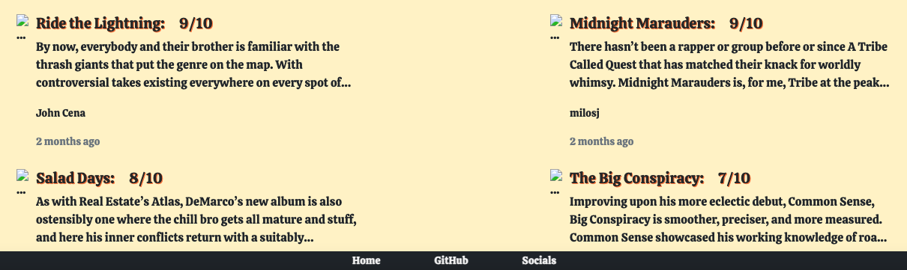

    

# 'Album Review App' : SEI Project 2             

## Description:       

<!-- TODO : link to Milos' GitHub profile -->

This is a full-stack web app - _Album Review App_: a site where users can add and then review music albums - built as part of a paired project with Milos Jocic over the course of a week, for the second project in GA London's Software Engineering Immersive course. The app uses an Express framework, Node.js platform and an Atlas-hosted MongoDB NoSQL database. The deployed project was presented to my GA Instructional Team and fellow SEI cohort on 26/08/22.        

I was 'Team Leader' for this project, taking responsibility for Git version control and deployment of the completed app. I worked on broader functionality across the site both in Frontend and Backend: setting up `server.js` config, creating Models, writing routes and APIs, implementing Views, forms and user input. I also took ownership of UI styling and mobile responsive formatting.        

<!-- TODO : insert main app image here -->

## Links:        

[Deployment link](http://albumsei66.herokuapp.com/auth/landing)      
[Google Doc README](https://docs.google.com/document/d/1NRj3XemKBEfr_EkvYh_mGM_67lGeFrmeTPrK0aQonyQ/edit#heading=h.164sp507m3e)    

## Getting started & Install:       

Please feel free to sign in as user: `guest@guest.com` // pw: `London2012`, or you can create your own account with 'Sign Up'.      

Please note that at present, there is an issue with image upload where Heroku's ephemeral file storage deletes any newly uploaded images after less than 24 hours. As such, many of the image links are currently broken where uploaded files have been removed, and any images newly uploaded will not persist past a 24 hour period before breaking.           

To contribute, please fork from [GitHub](https://github.com/hphilpotts/Album-Review-App-Project-2-General-Assembly-SEI-66) and then run `npm i` to install the required dependencies, alternatively see `package.json`, submitting a pull request for any completed contributions.      

## Technologies used:       

- HTML5, CSS3, ES6 JavaScript, EJS, Mongoose        
- Express, Node.js, Atlas-hosted MongoDB        
- Express-EJS-Layouts, Multer image upload, Heroku app hosting       
- Visual Studio Code, MongoDB Compass       

## Brief & Project aims:        

The brief for this project was to build a web app as a pair 'from scratch', using an Express framework.Technical requirements included:        
- Use Express, Mongoose, Node.js and MongoDB to build the app, host the completed app on Heroku.              
- Employ MVC architecture in building the app.      
- Include a User resource, with signup/in and authentication/authorisation.            
- Include two other resources with full CRUD functionality.          

Stretch goals included:     
- Make the app mobile responsive.       
- Make use of a CSS library such as Bootstrap.      
- Add image upload functionality.       

The aim of the project was to consolidate our learning from weeks 4 & 5 of the course: in particular the concepts of 'Frontend' and 'Backend', OOJS, and database relationship and associations, as well as the use of Express, EJS, Mongoose, and MongoDB. In addition to consolidating knowledge, this project provided a first experience of working with another developer, with all the additional considerations and neccessities, for example management of Git/GitHub process, communication and planning, and collaborative problem-solving.        

## Key takeaways and learnings:     

This was a really exciting project for me, as it was the first time I had properly collaborated with another developer on a piece of work. We had been given relatively little in the way of guidance or instructions when it came to working as a pair; as a result, we had to very much learn how best to code together 'on the fly' which was both challenging and rewarding. I am really grateful for the fact that Milos and I had a great working dynamic: our skills and approaches complemented each other and we had fun working on this project together - for me this was a great start to collaborative coding!       

Much of the project was completed using very close collaboration, particularly using screen sharing. The benefits of working together became apparent very quickly: two pairs of eyes catch bugs more quickly, and one person may remember a small but crucial tidbit of information from a past lecture where the other does not. Equally, the challenges of working as a pair rather than solo also became apparent very quickly: Git & GitHub become significantly more complicated to use compared to lone working, code conflicts are many and frequently encountered, and time management becomes more important.       

Ultimately, this project was really enjoyable, and the feeling of collaboratively producing something you are a proud of made me feel excited for my future working in software development. I learned a lot both technically and in terms of how best to work as a team, and came away from the project more confident in my skills and knowledge.

Some key learnings from this project were as follows:       

- Git discipline is key: as soon as this slips, things start to go wrong quickly. A methodical, structured approach combined with clear and consistent communication was cruicial for smooth merges and seamless pull requests. Further to this, merge issues are not a disaster: they are part and parcel of collarborative coding; don't panic and don't rush resolving conflicts!        
- Debugging as a pair is a great way of resolving issues quickly when you have run out of ideas working solo. Fresh eyes and a new perspective are often the key to unlocking a problem straight away!      
- It's fine to change your project idea (if you do it early enough).     
- EJS is still just JavaScript (albeit with some differences and limitations): at first I struggled to translate my understanding of JS into using EJS, but once I got over the few differences it just 'clicked'! Also, Express-EJS-layouts template-based views are a quick, powerful and efficient way of building and managing a web app.      
- Finding the 'right' communication is key: for us, this was about striking a balance between consistent and frequent communication in order to collaborate effectively, without needlessly breaking each others' concentration when working. Slack messages were great for non-urgent comms, whereas zoom was great for more immediate communication was required.     

## Successes and Challenges:      

       

Main 'wins' and successs from this project included:       
- Gaining confidence working with the Express framework, implementing CRUD operations, writing in EJS. Also, building a clearer understanding around the concepts of frontend/client-side and backend/server-side.          
- Getting experience working as a team rather than solo, as well as buidling confidence using Git/GitHub version control as a pair, and resolving merge conflicts. Further to this, I really enjoyed the experience of being a Team Lead for this project: particularly setting direction, provding support, having responsibility for the main GitHub repository, and hosting the finished app on Heroku.      
- Building confidence working with CSS: at times I struggled with CSS in Unit/Project 1, however during this project I found the concepts that previously seemed challenging - for example, positioning and flexbox - started to make more and more sense the longer I worked on them and the more issues I resolved.       

Challenges faced during the project included:       
- Managing Git/GitHub repositories, forks, branches and merges between two contributors for the first time. At points this was challenging, however this also made for a great learning experience (despite some dark moments where time and/or work was lost).      
- Facing merge conflicts: at first we assumed this was because we were doing something wrong - and indeed that merge conflicts were something to be worried about rather than expected - and this led to moments of panic (which is _not_ the right way to approach coding).        
- Backend error terminal messages were daunting at first, being longer and less transparent than typical frontend messages, however in time we learned that the key bits are normally at the start or end of the message.       
- Finding a balance between using Bootstrap to quickly add premade styling and elements, and using CSS to build and style our app in a more precise way that better suited our needs. Bootstrap is great for specific, quick, polished additions to the app, however I found that if Bootstrap did not provide exactly what we needed, it was quicker to 'custom make' elements of our site rather than lose significant amounts of time to trying to amend and wrangle Bootstrap into doing what we wanted! Further to this, confilcts can arise between Boostrap CSS and vanilla CSS if care is not taken.        
- Lastly, integrating image uploads (and getting this to work correctly) proved a challenge - doubly so when the app is hosted on Heroku rather than locally.       

## Bugs & Issues:       

- Uploaded images are lost (and therfore `` links break) after <24 hours: this is due to Heroku's ephemeral filesystem.        
- Upload functionality on 'Edit Albums' view is not working.        
- User sessions do not save consistently, as such login is occasionally required again during a single session.     

## Future improvements:     

## Production Process:      
